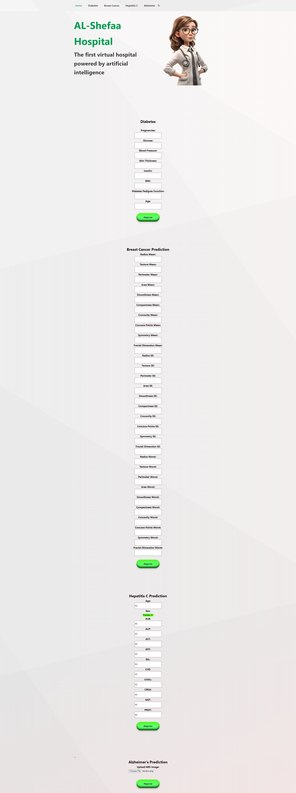

# AL - Shefaa Hospital 🏥

AL - Shefaa Hospital is an AI-powered disease diagnosis system utilizing machine learning and deep learning models. It is capable of diagnosing four diseases: diabetes, breast cancer, liver disease, and Alzheimer's. The system offers a user-friendly web interface for easy interaction. 🤖🔬

## Website Screenshot

*Website interface showing the main diagnosis dashboard*

## Table of Contents 📋
- [Installation](#installation)
- [Usage](#usage)
- [Features](#features)
- [Credits](#credits)
- [Intellectual Property Rights](#intellectual-property-rights)

## Installation 💻
To set up AL - Shefaa Hospital on your local machine, follow these steps:
1. Clone this repository:
   ```
   git clone https://github.com/mohamedelsayadd/Al-Shefaa-hospital-V1.git
   ```
2. Navigate to the project directory:
   ```
   cd Al-Shefaa-hospital
   ```
3. Install dependencies:
   ```
   npm install
   ```
4. Start the server:
   ```
   npm start
   ```

## Usage 🖥️
To use AL - Shefaa Hospital:
1. Open your web browser.
2. Navigate to the URL where the project is hosted.
3. Follow the on-screen instructions to input patient data and receive disease diagnoses.

## Features ⚕️
AL - Shefaa Hospital offers the following features:
- Diagnosis of diabetes 🩺
- Breast cancer detection 🎗️
- Liver disease analysis 🔬
- Alzheimer's assessment 🧠
- User-friendly web interface for easy interaction 👨‍⚕️
- Storage of prediction data in SQL Server databases 💾

## Credits 🛠️
AL - Shefaa Hospital utilizes the following third-party technologies:
- Python 🐍
- HTML
- CSS
- JavaScript
- SQL Server

## Intellectual Property Rights ©️
All intellectual property rights for AL - Shefaa Hospital belong to Engineer Mohamed Elsayad.
